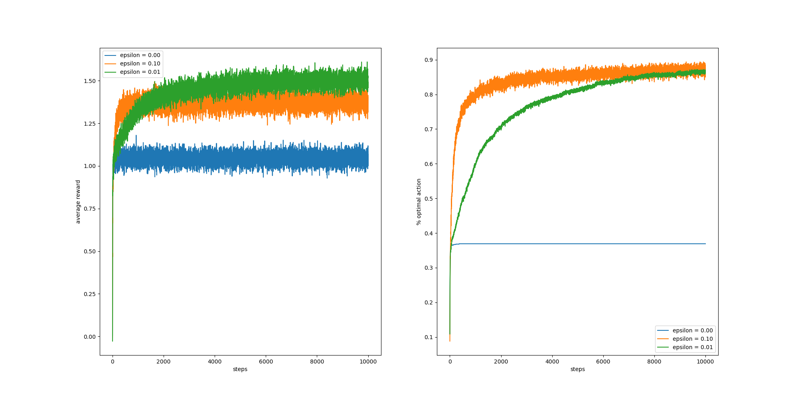

### Introduction 
This is a personal note for the book Reinforcement Learning: An Introduction (By Sutton & Bartol).
These codes (will) include:
+ Solutions to exercise problems
+ The code generating each figure in the book.

### Examples
***Exercise 2.3*** In the comparison shown in Figure 2.2, which method will perform best in the long run in terms of cumulative reward and probability of selecting the best action? How much better will it be? Express your answer quantitatively.

***Ans:***  
    The experiment is conducted with 10,000 iterations averaged by 1,000 runs and the epsilon=0.01 player performed best (see code for fig 2.2).  
    Reward Performance: ep=0.01 > ep=0.1 > ep=0
    Selection Performance: ep=0.01 > ep=0.1 > ep=0
        

### References
The bulk part of the implementations are from:
+ The exercise solutions (However, this part are somewhat outdated because the latest version of the book has covered a lot of new exercises.)https://github.com/LyWangPX/Reinforcement-Learning-2nd-Edition-by-Sutton-Exercise-Solutions
+ The code for figures: https://github.com/ShangtongZhang/reinforcement-learning-an-introduction

### Finally
Again, this serves mainly as a personal note for the book and it's still being updated becuase I'm, at the same time, trying to get familiar with the RL research area.  
If you have any questions, feel free to contact me at brycechen1849@gmail.com .