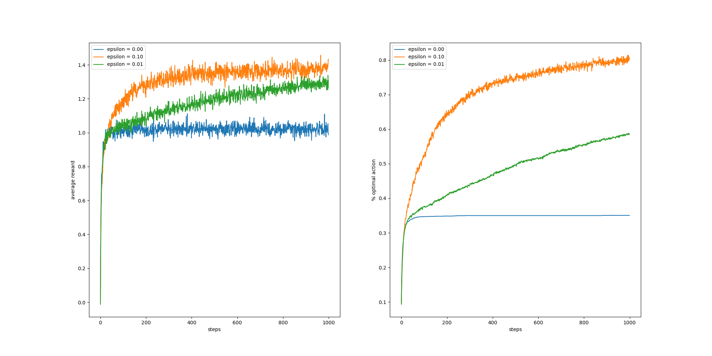
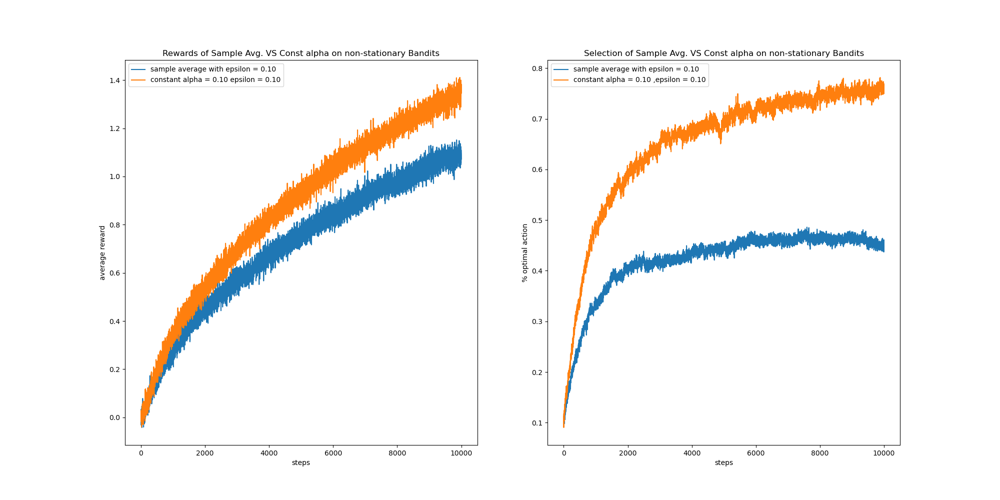

### Introduction 
This [repo](https://github.com/brycechen1849/RL2BookSolutions) is a note for the book Reinforcement Learning: An Introduction 2nd Edition by Sutton & Barto.
It serves mainly as a guide to have a thinking in depth on exercise problems proposed in this book.  

It aims to provide answers that are intuitively reasonable, experimentally proved and mathematically proved. Most of the time the first two are guaranteed.
Hopefully the verbosity and elaboration would get you inspired :D . If you ever get confused reading this note, raise an issue, pull a merge request or if you prefer, feel free to contact me at brycechen1849@gmail.com.

This note is now being rapidly updated because I'm still intensively getting familiar with the RL research area. The codes (will) include:
+ Experimentally proved solutions to exercise problems with reasonable explanation 
+ The code generating each figure in the book

### Solutions
[PDF Release](https://brycechen1849.github.io/RL2BookSolutions/pdf) will soon be available once I finished the note. 🚧   
Web hosted docs are available and I believe these should serve the purpose well enough :    
+ [Chapter 1](https://brycechen1849.github.io/RL2BookSolutions/solution_ch1) exercise solutions ☑️ 
+ [Chapter 2](https://brycechen1849.github.io/RL2BookSolutions/solution_ch2) exercise solutions ☑️ 
+ [Chapter 3](https://brycechen1849.github.io/RL2BookSolutions/solution_ch3) exercise solutions 🏃 (in progress ...)
+ ...  

### Dependencies
+ I use Python 3.6 installed via Anaconda environment on OSX 10.15.6. Other Python versions or system platforms are not tested yet, but it would be on theory working.
+ numpy == 1.19
+ matplotlib == 3.3.1
+ tqdm == 4.49

### Specifications
Usually, **random seed = 0** (as specified in code). This allows everyone to reproduce the work exactly the same way as I did in this note.  
I believe this, reproducibility, is of great importance when your own code is behaving strangely but you are not sure if it's a bug. 

### Examples
1. ***Exercise 2.3*** In the comparison shown in Figure 2.2, which method will perform best in the long run in terms of cumulative reward and probability of selecting the best action? How much better will it be? Express your answer quantitatively.  
     
    
    ***Ans:***  
    The experiment is conducted with 10,000 iterations averaged by 2,000 runs and the epsilon=0.01 player performed best (see code for fig 2.2).  
    Reward Performance: ep=0.01 > ep=0.1 > ep=0  
    Select Performance: ep=0.01 > ep=0.1 > ep=0
        

1. ***Exercise 2.5 (programming)***  Design and conduct an experiment to demonstrate the difficulties that sample-average methods have for non-stationary problems. 
Use a modified version of the 10-armed testbed in which all the q*(a) start out equal and then take independent random walks
 (say by adding a normally distributed increment with mean zero and standard deviation 0.01 to all the q*(a) on each step).
Prepare plots like Figure 2.2 for an action-value method using sample averages, incrementally computed, and another action-value method using a constant step-size parameter, a = 0.1. Use epsilon = 0.1 and longer runs, say of 10,000 steps.
    
    ***Ans:***  
    Experiments are conducted in exercise_2_5.py  
    The lines inserted to Bandit.step for the non-stationary bandit implementation:  
    ``` python  
    # Nonstationary Bandit    
    self.q_true += np.random.normal(loc=0, scale=0.01, size=(self.k,))
    self.best_action = np.argmax(self.q_true)
    ```   
    and in Bandit.reset:
    
    ``` python
    # As stated in the prob, q starts at 0.
    self.q_true = np.zeros(shape=(self.k,)) + self.true_reward
    ```
   
    The constant step-size method outperformed the sample average method in terms of both average reward and best action hit rate.                                                                                                                                                                                                                                                                                                                                                                                                                                                                                                                                                                                                                                                                                                                                                                                                                    
                                                                                                                                                                                                                                                                                                                                                                                                                                                                                                                                                                                                                                                                                                                                                                                                                  
    

    Unsatisfied with the simulation speed, I wrote a new version exercise_2_5_SIMR.py for this exercise prob. 
    SIMR stands for **Single Iteration Multi Runs** (You know it's from SIMD in chips). 
    Instead of going all the way through a complete run one after another, 
    this version simultaneously operates multi-runs at each iteration, as if those runs are in parallel.  
    This allowed us to utilize the power of the optimized vector computation tools in numpy, and it actually
    gets around **8x faster** than the first implementation.
    
### References
The code implementations references are:
+ Solutions to exercise problems (However, this part are somewhat outdated because the latest version of the book has covered a lot of new exercises):
[Reinforcement-Learning-2nd-Edition-by-Sutton-Exercise-Solutions](https://github.com/LyWangPX/Reinforcement-Learning-2nd-Edition-by-Sutton-Exercise-Solutions)
+ Code for each figure in the book: [reinforcement-learning-an-introduction](https://github.com/ShangtongZhang/reinforcement-learning-an-introduction)  

For figures, usage and examples can be accessed at *[Matplotlib Gallery](https://matplotlib.org/gallery/index.html)*
