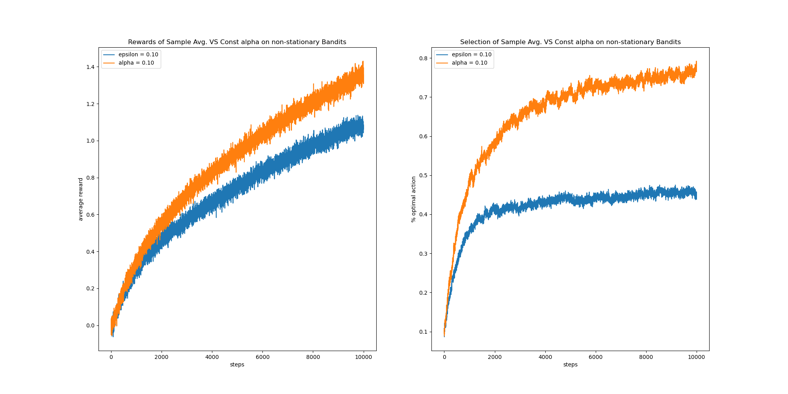

### Introduction 
This is a personal note for the book Reinforcement Learning: An Introduction (By Sutton & Barto).
These codes (will) include:
+ Solutions to exercise problems
+ The code generating each figure in the book.

The solutions are in exercise_answers.md. PDF Release will be available soon.

### Dependencies
+ I use Python 3.6 installed via Anaconda environment on OSX 10.15.6. Other Python versions or system platforms are not tested yet, but it would be on theory working.
+ numpy == 1.19
+ matplotlib == 3.3.1
+ tqdm == 4.49

### Examples
1. ***Exercise 2.3*** In the comparison shown in Figure 2.2, which method will perform best in the long run in terms of cumulative reward and probability of selecting the best action? How much better will it be? Express your answer quantitatively.

    ***Ans:***  
    The experiment is conducted with 10,000 iterations averaged by 1,000 runs and the epsilon=0.01 player performed best (see code for fig 2.2).  
    Reward Performance: ep=0.01 > ep=0.1 > ep=0  
    Select Performance: ep=0.01 > ep=0.1 > ep=0
        

1. ***Exercise 2.5 (programming)***  Design and conduct an experiment to demonstrate the difficulties that sample-average methods have for non-stationary problems. 
Use a modified version of the 10-armed testbed in which all the q*(a) start out equal and then take independent random walks
 (say by adding a normally distributed increment with mean zero and standard deviation 0.01 to all the q*(a) on each step).
Prepare plots like Figure 2.2 for an action-value method using sample averages, incrementally computed, and another action-value method using a constant step-size parameter, a = 0.1. Use epsilon = 0.1 and longer runs, say of 10,000 steps.
    
    ***Ans:***  
    Experiments done by exercise_2_5.py  
    The lines inserted to Bandit.step for the non-stationary bandit implementation:  
    ```python  
    # Nonstationary Bandit    
    self.q_true += np.random.normal(loc=0, scale=0.01, size=(self.k,))
    self.best_action = np.argmax(self.q_true)
    ```   
    The constant step-size method outperformed the sample average method in terms of both average return and best action hit rate.                                                                                                                                                                                                                                                                                                                                                                                                                                                                                                                                                                                                                                                                                                                                                                                                                    
                                                                                                                                                                                                                                                                                                                                                                                                                                                                                                                                                                                                                                                                                                                                                                                                                  
   
### References
The bulk part of the implementations are from:
+ The exercise solutions (However, this part are somewhat outdated because the latest version of the book has covered a lot of new exercises). https://github.com/LyWangPX/Reinforcement-Learning-2nd-Edition-by-Sutton-Exercise-Solutions
+ The code for figures: https://github.com/ShangtongZhang/reinforcement-learning-an-introduction  

For the figures, their usages can be accessed at *[Matplotlib Gallery](https://matplotlib.org/gallery/index.html)*
### Finally
Again, this serves mainly as a personal note for the book and it's still being rapidly updated because I'm, at the same time, trying to get familiar with the RL research area.  
If you have any questions, feel free to contact me at brycechen1849@gmail.com .