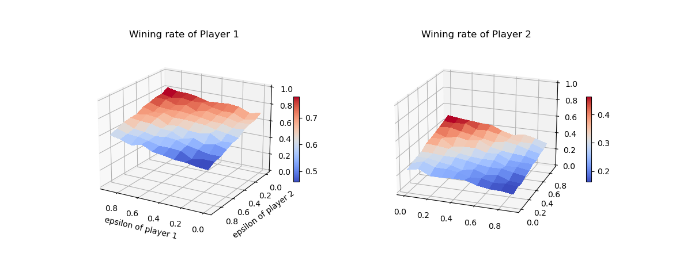
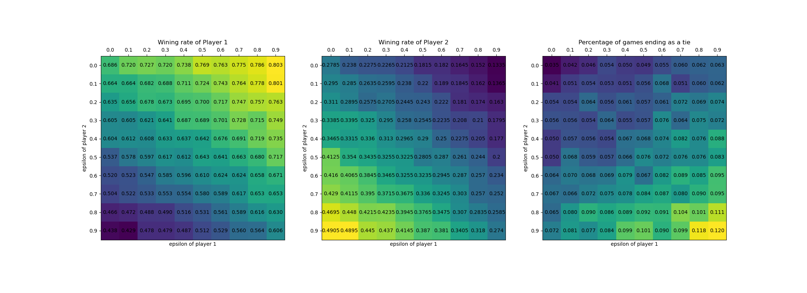

# Exercise Solutions

## Introduction 
See the source code on [Github Repo](https://github.com/brycechen1849/RL2BookSolutions), and if you have any questions, feel free to contact me at ***brycechen1849@gmail.com*** .
It serves mainly as a public note for the book and it's still being rapidly updated because I'm, at the same time, trying to get familiar with the RL research area.  

### References
The code implementations references are:
+ Solutions to exercise problems (However, this part are somewhat outdated because the latest version of the book has covered a lot of new exercises).
[Reinforcement-Learning-2nd-Edition-by-Sutton-Exercise-Solutions](https://github.com/LyWangPX/Reinforcement-Learning-2nd-Edition-by-Sutton-Exercise-Solutions)
+ Code for each figure in the book: [reinforcement-learning-an-introduction](https://github.com/ShangtongZhang/reinforcement-learning-an-introduction)  

For figures, usage and examples can be accessed at *[Matplotlib Gallery](https://matplotlib.org/gallery/index.html)*

## Solutions

### Chapter 1

Chapter 1 is an introductory chapter with ***tic-tac-toe*** game as an example of the full story. 
It involves more advanced topics on reinforcement learning that I would choose to implement when later chapters are finished.
(Although there is a implementation of the full simulation in tic-tac-toe.py)
1. ***Exercise 1.1 Self-Play*** Suppose, instead of playing against a random opponent, the reinforcement learning algorithm described above played against itself, with both sides learning. What do you think would happen in this case? Would it learn a different policy for selecting moves?
    
    ***Ans:***
    
    I guess from intuition that the process would start with both side learning to play better games as both side have no good estimations on each state.
    As they update their estimations, ties will be more and more common.
    They will converge to all ties at last.
    
    
    
    Since the final performance are highly dependent to epsilons. I did the experiments with a grid of epsilons ranging from 0 ~ 0.9. Each set trains for 10,0000 rounds of games and tests on 10,000 rounds of games.
    
    
    
    Test results are shown on the figure. Trend is that with higher epsilon a player would have higher winning rate. Opponent's desire to explore has negative effect on a player's performance. 

1. ***Exercise 1.2***
1. ***Exercise 1.3***
1. ***Exercise 1.4***
1. ***Exercise 1.5***