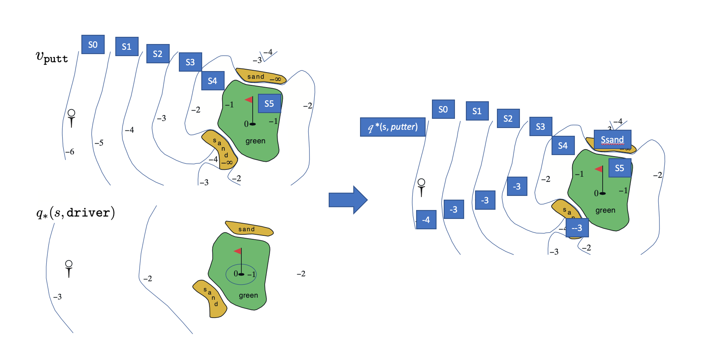

<head>
    
    
</head>

# Exercise Solutions

## Introduction 
See the source code on [Github Repo](https://github.com/brycechen1849/RL2BookSolutions), and if you have any questions, feel free to contact me at ***brycechen1849@gmail.com*** .
It serves mainly as a public note for the book and it's still being rapidly updated because I'm, at the same time, trying to get familiar with the RL research area.  

### References
The code implementations references are:
+ Solutions to exercise problems (However, this part are somewhat outdated because the latest version of the book has covered a lot of new exercises).
[Reinforcement-Learning-2nd-Edition-by-Sutton-Exercise-Solutions](https://github.com/LyWangPX/Reinforcement-Learning-2nd-Edition-by-Sutton-Exercise-Solutions)
+ Code for each figure in the book: [reinforcement-learning-an-introduction](https://github.com/ShangtongZhang/reinforcement-learning-an-introduction)  

For figures, usage and examples can be accessed at *[Matplotlib Gallery](https://matplotlib.org/gallery/index.html)*

## Solutions

### Chapter 3
1. ***Exercise 3.1*** Devise three example tasks of your own that fit into the MDP framework, identifying for each its states, actions, and rewards. Make the three examples as different from each other as possible. The framework is abstract and flexible and can be applied in many different ways. Stretch its limits in some way in at least one of your examples.

    ***Ans:***  MDPs have markov property that a state must include information about all aspects of the past agent–environment interaction that make a difference for the future.  
    Three Examples:  
    + An agent that plays the game of go. the board represents the state. Location of the next move is it's action and reward is usually 0 after each move because the game is not yet finished, only when it's finished, the reward is a positive value if it wins or negative if it loses.  
    + An agent that trades assets in a financial market. Prices and other financial indices are the state. Actions include holding, short and long. the rewards are given after each action by it's profitability.
    + An agent that is used as temperature controller chip in an AC. current voltage, power and temperature consist of the state. The voltage and power to output are the action and reward is positive if it keeps the temperature in a predefined range.  
    The limits of example 2 (Trading agent) is that the state is partially observable to the agent. Thus the agent will receive an observation instead of a state in each interaction. Make if sometimes impossible to distinguish from two different states that has same observation.

2. ***Exercise 3.2*** Is the MDP framework adequate to usefully represent all goal-directed learning tasks? Can you think of any clear exceptions? 

    ***Ans:***  MDP is a framework modeling the decision making process of an learning agent. It has limitations. for example, the above described (exercise 3.1) trading agent, it does not meet the markov property because the 'state' it receives does not fully represents the full information it needs to tell which situation it is in. To resolve this problem, POMDP is proposed that an agent receives an observation that is partially observed from a state in markov decision process. it decides actions based on partially observed state instead a full state and receives again an partially observed state.
    
3. ***Exercise 3.3***  Consider the problem of driving. You could define the actions in terms of the accelerator, steering wheel, and brake, that is, where your body meets the machine. Or you could define them farther out—say, where the rubber meets the road, considering your actions to be tire torques. Or you could define them farther in—say, where your brain meets your body, the actions being muscle twitches to control your limbs. Or you could go to a really high level and say that your actions are your choices of where to drive. What is the right level, the right place to draw the line between agent and environment? On what basis is one location of the line to be preferred over another? Is there any fundamental reason for preferring one location over another, or is it a free choice? 
   
    ***Ans:*** I think there will be both agent that has low level control of motors and that has high level control of where to go. The later agent does the decision making job, such as when there is a stop sign, it decides if the whole vehicle should be stopping in a few seconds. And, the low level controller agent will execute the order from that high level agent in the form that it receives a state that explicitly requires it to do so. Such system and sub-systems are common in latest auto-driving implementation. It brakes down the job and assign them to proper disposal departments.

4. ***Exercise 3.4*** 
    Give a table analogous to that in Example 3.3, but for p(s' , r | s, a). It should have columns for s, a, s0, r, and p(s',r|s,a), and a row for every 4-tuple for which p(s',r|s,a) > 0.
    
    ***Ans:***  
    Since $p(s'\mid s,a) = \sum_{r \in R}{p(s',r \mid s,a)}$ and fortunately each state has only one possible reward (or it's already an expected value). Thus we have:  

    |s|a|s'|r|p(s', r&#124;s,a)|  
    |----|----|----|----|:----:|  
    |high|wait|high|r_wait|1|  
    |high|search|high|r_search|a|  
    |high|search|low|r_search|1-a|  
    | high   | recharge |   high | 0   |  1 (Not necessary)                 |  
    | low   | wait |   low | r_wait   |  1                 |  
    | low   | search |   low | r_search   |  b                 |  
    | low   | search |   high | -3   |  1-b (deplete & recharge)           |  
    | low   | recharge |   high | 0   |  1                 |  
    
1. ***Exercise 3.5*** The equations in Section 3.1 are for the continuing case and need to be modified (very slightly) to apply to episodic tasks. Show that you know the modifications needed by giving the modified version of (3.3).
    
    ***Ans:*** change the set of s' from S(Non-termination state) to S+(All states including termination state)  
    The original equation is:   
    $\displaystyle\sum_{s' \in S}{\displaystyle\sum_{r \in R}{p(s',r \mid s,a)}}=1,\forall s\in S,\forall a\in A(s).$         
    The modified version is:  
    $\displaystyle\sum_{s' \in S^+}{\displaystyle\sum_{r \in R}{p(s',r \mid s,a)}}=1,\forall s\in S,\forall a\in A(s).$    
    where, $S$ stands for non-termination states and $S^+$ stands for all states including termination states.  
    
1. ***Exercise 3.6*** Suppose you treated pole-balancing as an episodic task but also used discounting, with all rewards zero except for -1 upon failure. What then would the return be at each time? How does this return differ from that in the discounted, continuing formulation of this task?  
    
    ***Ans:***   Suppose we have episodic length $T$, and current time step $t$, then current return is:  
    $G_t \doteq R_{t+1} + R_{t+2} + R_{t+3} + \cdots + R_{T} $  
    And for the discount setting we have:  
    $G_t \doteq \gamma^0 R_{t+1} + \gamma^1 R_{t+2} + \gamma^2 R_{t+3} + \cdots + \gamma^{T-t-1} R_{T} = -\gamma^{T-t-1}$  
    where $R_{T} = -1$ and all others 0  
    This is actually the same as $-\gamma^{K}$ in continuous task.  
    
1. ***Exercise 3.7*** Imagine that you are designing a robot to run a maze. You decide to give it a reward of +1 for escaping from the maze and a reward of zero at all other times. The task seems to break down naturally into episodes—the successive runs through the maze—so you decide to treat it as an episodic task, where the goal is to maximize expected total reward (3.7). After running the learning agent for a while, you find that it is showing no improvement in escaping from the maze. What is going wrong? Have you effectively communicated to the agent what you want it to achieve?  
    
    ***Ans:***   
    There are 2 ways to tell the agent what we want it to do:
    + Use discount rate $\gamma$ to indicate that the earlier it gets outside the higher reward it would get.  
    + Use reward -0.01 as punishment for each time step before it gets outside.  
    Both method will in effect change the return estimation it assumes at a time step, making it struggle to get outside as soon as possible.  
        
1. ***Exercise 3.8***  Suppose $\gamma$= 0.5 and the following sequence of rewards is received R1 = -1, R2 =2, R3 =6, R4 =3, and R5 =2, with T =5. What are G0, G1, ...,G5? Hint: Work backwards.

    ***Ans:*** The lists are:  
    + $G_5 = R_6 = 0 $  (By definition of terminal state)
    + $G_4 = R5 + \gamma G_5 = 2 $  
    + $G_3 = R4 + \gamma G_4 = 4 $  
    + $G_2 = R3 + \gamma G_3 = 8 $  
    + $G_1 = R2 + \gamma G_2 = 6 $  
    + $G_0 = R1 + \gamma G_1 = 2 $  
        
1. ***Exercise 3.9*** Suppose $\gamma$ = 0.9 and the reward sequence is R1 = 2 followed by an infinite sequence of 7s. What are G1 and G0?

    ***Ans:***  
    For continuous task:  
    $G_1  = \gamma^0 R_2 + \gamma^1 R_3 + \gamma^2 R_4 + \cdots = R \frac{1-\gamma^n}{1-\gamma} = 70  $  
    because for n large enough $ \lim\limits_{n \to +\infty} \gamma^n = 0  $  
    Thus we have  
    $G_0 =  R1 + \gamma G_1  = 2 + 63 = 65$  
    
1. ***Exercise 3.10*** Prove the second equality in (3.10).  

    ***Ans:***  
    $G_t \doteq \gamma^0 R_{t+1} + \gamma^1 R_{t+2} + \gamma^2 R_{t+3} + \cdots $  
    Multiplying both sides of this equation with $\gamma$  
    $\gamma G_t = \gamma^1 + \gamma^2 + \gamma^3 + \gamma^4 + \cdots + \gamma^{\infty} \gamma$   
    Where $\gamma^{\infty} \gamma$ is an infinitely small term and can be written as $\gamma^{\infty}$ .   
    Then by subtracting both sides of the first equation with the second  
    $(1-\gamma) G_t = 1 - \gamma^{\infty} $  
    Where $ \lim\limits_{n \to +\infty} \gamma^n = 0 $   
    Thus    
    $G_t = \frac{1}{1-\gamma}$   
    $Q.E.D$  
    
1. ***Exercise 3.11*** If the current state is $S_t$, and actions are selected according to stochastic policy $\pi$, then what is the expectation of $R_{t+1}$ in terms of $\pi$ and the four-argument function $p$ (3.2)?
    
    ***Ans:***
    \begin{equation}  
        E[R_{t+1}\mid s] = \displaystyle\sum_{a \in A(s)}{ \pi (a|s) \displaystyle\sum_{s', r}{ r \times p(s',r \mid s,a)} }  
    \end{equation}  
    The basic idea here is that for each state s, there are several actions to choose and for each action chosen, there are several possible next state and reward pair. The expected reward is thus weighted average over these possible rewards.    
    
1. ***Exercise 3.12*** Give an equation for $v_{\pi}$ in terms of $q_{\pi}$ and $\pi$  
    
    ***Ans:***  
    \begin{equation}  
    v_{\pi}(s) = \displaystyle\sum_{a \in A(s)}{\pi(a \mid s) \times q_{\pi}(s,a)}    
    \end{equation}  
    
1. ***Exercise 3.13*** Give an equation for $q_{\pi}$ in terms of $v_{\pi}$ and the four-argument p  
    
    ***Ans:***  
    \begin{equation}  
    q_{\pi}(s,a) = \displaystyle\sum_{s',r}{  p(s',r \mid s,a) \times (r + \gamma v_{\pi}(s')) }    
    \end{equation}  

1. ***Exercise 3.14*** The Bellman equation (3.14) must hold for each state for the value function $v_{\pi}$ shown in Figure 3.2 (right) of Example 3.5. Show numerically that this equation holds for the center state, valued at +0.7, with respect to its four neighboring states, valued at +2.3, +0.4, 0.4, and +0.7. (These numbers are accurate only to one decimal place.) 

    ***Ans:***
    According to equation (3.14):
    \begin{equation}      
    v_{\pi}(s) = \displaystyle\sum_a{\pi(a \mid s) \displaystyle\sum_{s',r }{ p(s',r \mid s,a) \times [r+ \gamma v_{\pi}(s')]}}  
    \end{equation}  
    Thus  
    \begin{equation}  
    v_{\pi}(s_{center})= \frac{1}{4} \times 0.9 \times (2.3+0.4-0.4+0.7) = 0.675 \approx 0.7    
    \end{equation}        
       
1. ***Exercise 3.15*** In the gridworld example, rewards are positive for goals, negative for running into the edge of the world, and zero the rest of the time. Are the signs of these rewards important, or only the intervals between them? Prove, using (3.8), that adding a constant c to all the rewards adds a constant, vc, to the values of all states, and thus does not affect the relative values of any states under any policies. What is vc in terms of c and $\gamma$?

    ***Ans:***   
    \begin{equation}  
    v_t = \gamma^0 + \gamma^1 + \gamma^2 + \gamma^3 + \cdots = \displaystyle\sum_{k=0}^{\infty}{r^k R_{t+k+1}}  
    \end{equation}  
    If a constant $c$ is added to each $R_k$, then   
    \begin{equation}  
    v_t = \displaystyle\sum_{k=0}^{\infty}{r^k (R_{t+k+1}+c)} =  \displaystyle\sum_{k=0}^{\infty}{r^kR_{t+k+1}} +  \displaystyle\sum_{k=0}^{\infty}{r^k c}
    \end{equation}  
    The second term will converge to a constant $c \frac{1}{1-\gamma}$ according to the proof in exercise 3.10:  
    \begin{equation}  
    v_t = \displaystyle\sum_{k=0}^{\infty}{r^kR_{t+k+1}} + \frac{c}{1-\gamma}   
    \end{equation}  
    Thus,  
    \begin{equation}  
    v_c = \frac{c}{1-\gamma}   
    \end{equation}  
    Because adding a constant to all reward does not affect the relative values of any states under any policies, the signs of rewards are not important and only the intervals between them matters.  
    
1. ***Exercise 3.16*** Now consider adding a constant c to all the rewards in an episodic task, such as maze running. Would this have any effect, or would it leave the task unchanged as in the continuing task above? Why or why not? Give an example.

    ***Ans:***   The state value $v_t$:  
    \begin{equation}
        v_t \doteq \gamma^0 R_{t+1} + \gamma^1 R_{t+2} + \gamma^2 R_{t+3} + \cdots + \gamma^{T-(t+1)} R_{T} = \displaystyle\sum_{k=t+1}^{T}{ \gamma^{k-(t+1)} R_{k} }   
    \end{equation}
    Adding a constant $c$ on each reward:  
    \begin{equation}
        v_t \doteq  \displaystyle\sum_{k=t+1}^{T}{ \gamma^{k-(t+1)} (R_{k} + c) }  
    \end{equation}
    The extra term here is:
    \begin{equation}
        v_c(t) = \displaystyle\sum_{k=t+1}^{T}{ \gamma^{k-(t+1)} c }   
    \end{equation}  
    Since $c$ is a constant:  
    \begin{equation}
        v_c(t) = c \displaystyle\sum_{k=t+1}^{T}{ \gamma^{k-(t+1)}}  
    \end{equation}
    This is not a constant to all states under any policy, therefore the assumption here does not stand.  

1. ***Exercise 3.17*** What is the Bellman equation for action values, that is, for $q_{\pi}$? It must give the action value q⇡(s,a) in terms of the action values, q⇡(s0,a0), of possible successors to the state–action pair (s,a). Hint: the backup diagram to the right corresponds to this equation. Show the sequence of equations analogous to (3.14), but for action values.

    ***Ans:***
    \begin{equation}   
        q_{\pi}(s,a) = E[G_t \mid S_t = s, A_t = a]  
    \end{equation}   
    
    \begin{equation}   
        q_{\pi}(s,a) = E[ R_t+1 + \gamma G_{t+1}  \mid S_t = s, A_t = a]  
    \end{equation}   
    
    \begin{equation}  
        q_{\pi}(s,a) = \sum_{s',r}{\left[p(s',r \mid s,a) \times  \left(r + \gamma \sum_{a' \sim \pi}{\pi(a' \mid s') q_{\pi}(s',a')}\right)\right]}  
    \end{equation}  
    
    Note that both state transition and policy $\pi$ are stochastic, thus making it an nested expectation.  

1. ***Exercise 3.18*** The value of a state depends on the values of the actions possible in that state and on how likely each action is to be taken under the current policy. We can think of this in terms of a small backup diagram rooted at the state and considering each possible action. Give the equation corresponding to this intuition and diagram for the value at the root node, $v_{\pi}(s)$, in terms of the value at the expected leaf node, $q_{\pi}(s,a)$, given $S_t = s$. This equation should include an expectation conditioned on following the policy, $\pi$. Then give a second equation in which the expected value is written out explicitly in terms of $\pi(a \mid s)$ such that no expected value notation appears in the equation.

    ***Ans:***  
    \begin{equation}
    v_{\pi}(s) = E_{\pi}[q_{\pi}(s,a)] = \sum_{a}{\pi(a \mid s) q_{\pi}(s,a)}
    \end{equation}  
    
    
1. ***Exercise 3.19*** The value of an action, $q_{\pi}(s,a)$, depends on the expected next reward and the expected sum of the remaining rewards. Again we can think of this in terms of a small backup diagram, this one rooted at an action (state–action pair) and branching to the possible next states. Give the equation corresponding to this intuition and diagram for the action value, $q_{\pi}(s,a)$, in terms of the expected next reward, $R_{t+1}$, and the expected next state value, $v_{\pi}(S_{t+1})$, given that $S_t =s$ and $A_t =a$. This equation should include an expectation but not one conditioned on following the policy. Then give a second equation, writing out the expected value explicitly in terms of $p(s',r \mid s,a)$ defined by (3.2), such that no expected value notation appears in the equation.

    ***Ans:***   
    \begin{equation}
    q_{\pi}(s,a) = E_{\pi}[R_{t+1} + \gamma s_{\pi}(S_{t+1}) \mid S_t=s,A_t=a]
    \end{equation} 

    \begin{equation}
    q_{\pi}(s,a) = \sum_{s',r}{p(s',r|s,a)(r + \gamma v_{\pi}(s'))}
    \end{equation} 

1. ***Exercise 3.20*** Draw or describe the optimal state-value function for the golf example.   

    ***Ans:*** We can view the value as 'how many strokes do I need to sink the ball'.  
    From the tee, the best sequence of actions is two drives and one putt, sinking the ball in three strokes.  
    Areas that are outside of the green (including sands) follows $q_*(s, driver)$ and inside the green $v_{putter}(s)$  

1. ***Exercise 3.21*** Draw or describe the contours of the optimal action-value function for putting, $q_*(s,putter)$, for the golf example.  

    ***Ans:***  The action sequences of $q_*(s,putter)$ are, by definition, first putter at state s and thereafter use whatever action the optimal policy indicates.   
    So the following illustration is an approximation since the state transition properties of this golf game is not quite clear. But let's have a try.     
      
    \begin{equation}
        Figure
    \end{equation}  
        
    $ q_* (s_0,putter) $ is -4 because a putter at the tee takes it to state s1, and then 2 drivers and 1 putter would be sufficient to finish the job.  
    $ q_* (s_1,putter) $ is -3 because a putter at the s1 takes it to state s2, and then because it's already in states that have $q_*(s,driver)=-2$, only 1 drivers and 1 putter would be sufficient to finish the job.  
    Other State values can also be derived from this method.  
    Note that for sands areas, A putter will not bring the ball out, and it need a driver and a putter to get the job done.  
    
1. ***Exercise 3.22*** Consider the continuing MDP shown on to the right. The only decision to be made is that in the top state, where two actions are available, $left$ and $right$. The numbers show the rewards that are received deterministically after each action. There are exactly two deterministic policies, $\pi_{left}$ and $\pi_{right}$. What policy is optimal if $\gamma$ = 0? If $\gamma$ = 0.9? If $\gamma$ = 0.5?  

    ***Ans:***   
    + $\gamma=0$, both has +$\infty$ value but the right one is 2x larger because accumulated reward grow faster.    
        + $q_{\pi_{left}}(s_0, left) = q_{\pi_{left}}(s_1, left) = \sum_{i=0}^{\infty}{\gamma^{2i}}=+\infty $   
        + $q_{\pi_{right}}(s_0, right) = q_{\pi_{right}}(s_1, right) =  \sum_{i=0}^{\infty}{2\gamma^{1+2i}}=+\infty $  
        + \begin{equation}
        \lim\limits_{\gamma \to 1} \frac{\frac{1}{1-\gamma^2}}{\frac{2\gamma}{1-\gamma^2}} = \lim\limits_{\gamma \to 1}\frac{1}{2\gamma} = \frac{1}{2}
        \end{equation}    

    + $\gamma=0.9$, the right one is better.
        + $q_{\pi_{left}}(s_0, left) = q_{\pi_{left}}(s_1, left) = \sum_{i=0}^{\infty}{\gamma^{2i}} \approx 5.26$   
        + $q_{\pi_{right}}(s_0, right) = q_{\pi_{right}}(s_1, right) = \sum_{i=0}^{\infty}{2\gamma^{1+2i}} \approx 9.47$  
    + $\gamma=0.5$, equally good. This is a very interesting result. because $\gamma$ is relatively small (0.5), future rewards are largely discounted.  
        + $q_{\pi_{left}}(s_0, left) = q_{\pi_{left}}(s_1, left) = \sum_{i=0}^{\infty}{\gamma^{2i}} \approx 1.33$   
        + $q_{\pi_{right}}(s_0, right) = q_{\pi_{right}}(s_1, right) = \sum_{i=0}^{\infty}{2\gamma^{1+2i}} \approx 1.33$    

        
1. ***Exercise 3.23*** Give the Bellman equation for q⇤ for the recycling robot.  

    ***Ans:*** There are 5 combinations, namely: q(h, s), q(h, w), q(l, s), q(l, w) and q(l, re).  
    Take q(h,s) for an example, we can use the backup graph and get:  
    $q_*(h, s) = p( h \mid h,s)(r_s + \gamma Max[q_*(h,s), q_*(h,w)])$  
    $        + p( l \mid h,s)(r_s + \gamma Max[q_*(l,s), q_*(l,w), q_*(l,re)])$  
    $        + p( h \mid h,w)(r_w + \gamma Max[q_*(h,s), q_*(h,w)])$  
    $q_*(h, s) = $  
    Other values can be derived using the same idea.
    
1. ***Exercise 3.x*** 

    ***Ans:***   

    
    
    
    