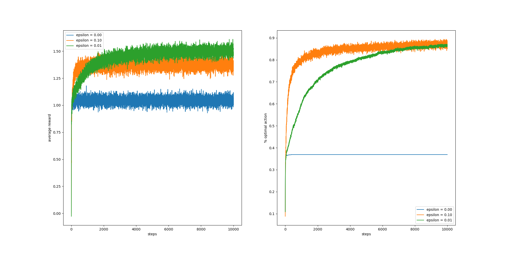
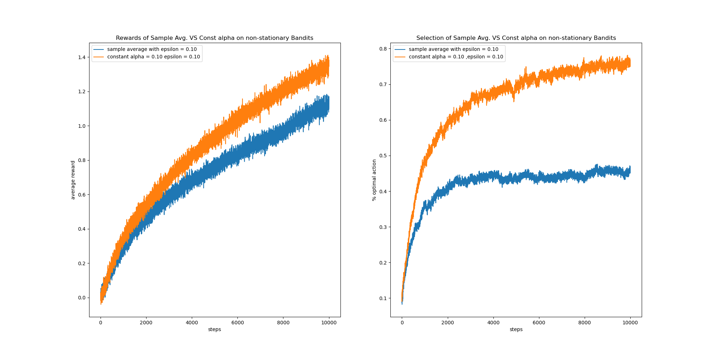

# Exercise Solutions

## Introduction 
This is a solution to exercises problems in the book Reinforcement Learning: An Introduction 2nd Edition(By Sutton & Barto).  
It serves mainly as a public note for the book and it's still being rapidly updated because I'm, at the same time, trying to get familiar with the RL research area.  
See the source code on [Github Repo](https://github.com/brycechen1849/RL2BookSolutions), and if you have any questions, feel free to contact me at ***brycechen1849@gmail.com*** .

### References
The bulk part of the implementations are from:
+ Solutions to exercise problems (However, this part are somewhat outdated because the latest version of the book has covered a lot of new exercises).
[Reinforcement-Learning-2nd-Edition-by-Sutton-Exercise-Solutions](https://github.com/LyWangPX/Reinforcement-Learning-2nd-Edition-by-Sutton-Exercise-Solutions)
+ Code for each figure in the book: [reinforcement-learning-an-introduction](https://github.com/ShangtongZhang/reinforcement-learning-an-introduction)  

For figures, usage and examples can be accessed at *[Matplotlib Gallery](https://matplotlib.org/gallery/index.html)*

## Solutions

### Chapter1

Chapter 1 is an introductory one with tic-tac-toe game as an example of the full story. 
It involves more advanced topics of reinforcement learning problem that I would choose to implement the full setting when I finished later chapters.
(Although there is a implementation of the simulation)
1. ***Exercise 1.1***
1. ***Exercise 1.2***
1. ***Exercise 1.3***
1. ***Exercise 1.4***
1. ***Exercise 1.5***


### Chapter2
1. ***Exercise 2.1*** In epsilon-greedy action selection, for the case of two actions and " = 0.5, what is the probability that the greedy action is selected?  

    ***Ans:***  
    p(A_epsilon) = epsilon = 0.5 . Since probability 1-p is for the other action, not all actions combined.

1. ***Exercise 2.2*** Bandit example Consider a k-armed bandit problem with k = 4 actions, denoted 1, 2, 3, and 4.
Consider applying to this problem a bandit algorithm using "-greedy action selection, sample-average action-value estimates,
 and initial estimates of Q1(a) = 0, for all a. Suppose the initial sequence of actions and rewards is A1 = 1, R1 =1,A2 =2,R2 =1,A3 =2,R3 =-2,A4 =2,R4 =2,A5 =3,R5 =0. On some of these time steps the " case may have occurred, causing an action to be selected at random. On which time steps did this definitely occur? On which time steps could this possibly have occurred?

    ***Ans:***  
    The greatest take away from here is that when doing epsilon-greedy way, exploratory actions include all actions but the greedy one.
    When there are more than one greedy actions, we randomly select an action among those equally good options.  
    Here is the simulation:
    ```  
    Step|Action|Reward|Estimations of the actions  
    01     1      -1      [-1, 0, 0, 0]
    02     2       1      [-1, 1, 0, 0]
    03     2      -2      [-1, -.5, 0, 0]
    04     2       2      [-1, .33, 0, 0]
    05     3       0      [-1, .33, 0, 0]
   ```
1. ***Exercise 2.3*** In the comparison shown in Figure 2.2, which method will perform best in the long run in terms of cumulative reward and probability of selecting the best action? How much better will it be? Express your answer quantitatively.

    ***Ans:***  
    The experiment is conducted with 10,000 iterations averaged by 2,000 runs and the epsilon=0.01 player performed best (see code generated fig 2.2).
    Quantitative analysis:  
    Reward Performance: ep=0.01 > ep=0.1 > ep=0
    Selection Performance: ep=0.01 > ep=0.1 > ep=0
    
    
1. ***Exercise 2.4*** If the step-size parameters, an, are not constant, then the estimate Qn is a weighted average of previously received rewards with a weighting different from that given by (2.6).
 What is the weighting on each prior reward for the general case, analogous to (2.6), in terms of the sequence of step-size parameters?
 
    ***Ans:***  
    Qn = Qn-1 + an * (Rn - Qn-1), Thus the weighting on each prior reward would be (1- an) for the n-th time step.
    
1. ***Exercise 2.5 (programming)***  Design and conduct an experiment to demonstrate the difficulties that sample-average methods have for non-stationary problems. 
Use a modified version of the 10-armed testbed in which all the q*(a) start out equal and then take independent random walks
 (say by adding a normally distributed increment with mean zero and standard deviation 0.01 to all the q*(a) on each step).
Prepare plots like Figure 2.2 for an action-value method using sample averages, incrementally computed, and another action-value method using a constant step-size parameter, a = 0.1. Use epsilon = 0.1 and longer runs, say of 10,000 steps.
    
    ***Ans:***  
    Experiments done by exercise_2_5.py  
    The lines inserted to Bandit.step for the non-stationary bandit implementation:  
    ```python  
    # Nonstationary Bandit    
    self.q_true += np.random.normal(loc=0, scale=0.01, size=(self.k,))
    self.best_action = np.argmax(self.q_true)
    ```   
    and in Bandit.reset:
    
    ``` python
    # As stated in the prob, q starts at 0.
    self.q_true = np.zeros(shape=(self.k,)) + self.true_reward
    ```
   
    The constant step-size method outperformed the sample average method in terms of both average reward and best action hit rate.                                                                                                                                                                                                                                                                                                                                                                                                                                                                                                                                                                                                                                                                                                                                                                                                                    
    
    
    
    I also wrote another code exercise_2_5_SIMR.py for this exercise. 
    The SIMR stands for **Single Iteration Multi Runs**. 
    Instead of, in the original code, going all the way through a complete run one after another, 
    this version simultaneously operates multi-runs at each iteration, as if those runs are in parallel.  
    This allowed us to utilize the power of the optimized vector computation tools in numpy, and it actually
    gets around **8x faster** than the first implementation.
    
    

1. ***Exercise 2.6*** *Mysterious Spikes* The results shown in Figure 2.3 should be quite reliable because they are averages over 2000 individual, randomly chosen 10-armed bandit tasks. Why, then, are there oscillations and spikes in the early part of the curve for the optimistic method? In other words, what might make this method perform particularly better or worse, on average, on particular early steps?
    
   
    ***Ans:***  
    The blue line with Q0 = 5 greatly encouraged exploration in the very first 10 iterations.  
    When it comes to the 11-th iteration, the action with highest q value is also statistically expected to have highest Q value
    (all Qs are around ~ 4.5 after first 10 iterations in code simulation).   
    Since epsilon=0, it will not explore but stick to this action until it's Q value is reduced to be sub-largest. Thus is the spike.  
    As the Q value goes down from around 4.5 (real q values are around -1~1 in code simulation, 
    so of course Q will be reducing because it is targeting R sampled from q).   
    Then came the oscillation among best action and the rest because each of them would be having the largest Q value once in a while.

   